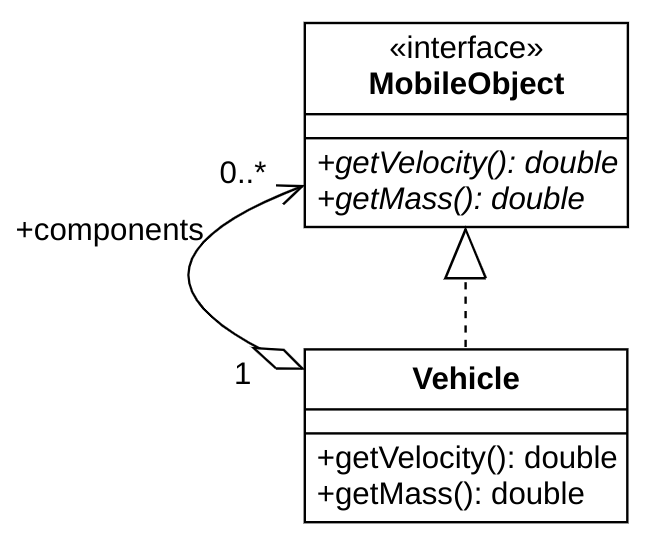
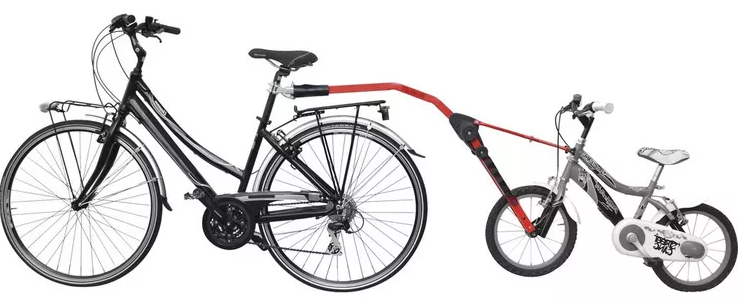

# Simulation de Vélo
Dans ce TP, vous réalisez des exercices sur les **motifs de conception**[^1] à l'aide d'une application simple qui simule, d'une manière très approximative, le fonctionnement d'un vélo.   

## Modalité
* Ces travaux pratiques sont notés.
* Ils sont à réaliser en binôme.
* Le compte rendu à remplir se trouve [ici](Rapport.md).
* Le compte rendu doit impérativement contenir le nom et prénom de chaque étudiant du binôme.

## Véhicule composite
Dans notre simulation, comme dans la vie réelle, un véhicule est un objet mobile, ses composants le sont aussi.
Un objet mobile a une vitesse, qui pourrait être nulle, ainsi qu'une masse.
La vitesse du véhicule est celle de son centre de masse.
Elle est calculée en fonction de la moyenne pondérée des vitesses de ses composants.
La masse, quant à elle, est la somme des masses des composants[^2].

Observez le diagramme de classe partiel suivant qui représente les relations entre les types `MobileObject` et `Vehicle`.

### Exercise 1

> Auquel motif de conception adhère ce modèle ? Identifiez le rôle de chaque de ces deux classes dans ce motif.
> 
> Réalisez la classe `TagAlongBike` qui représente un vélo parental traînant un vélo d'enfant (voir image).
> Le vélo parental est un vélo qui contient dans ses composants un autre vélo simple.
> Doit-on récrire la méthode `getVelocity()` ou la méthode `getMass()` pour la nouvelle classe ?

## Parcours véloce
Dans la méthode `getVelocity()` de la classe `Vehicule` on parcourt tous les composants d'un véhicule pour calculer sa vitesse.

### Exercise 2

> Quel motif de conception utilise la méthode `getVelocity()` pour parcourir les composants d'un véhicule ? 
> Quel avantage apporte ce motif ?
> 
> Modifier la structure de donnée utilisée pour stocker les composants d'un véhicule dans un `Set` au lieu d'un `List`.
> Doit-on modifier la réalisation de la méthode `getVelocity()` ?

## Simulation simultanée
La simulation est réalisée à un instant précis. Cet instant est détérminé par la méthode `getTime()` de la classe `Clock` qui représente une horloge.
À l'état actuel, le calcul de vitesse montre un problème dans les journaux d'événements[^3].
Chaque roue calcule sa vitesse à un instant généralement différent des autres roues.
Cela fait que les roues n'ont pas toujours la même vitesse.
Il s'agit d'un problème de synchronisation.

À présent, chaque roue a sa propre horloge, une instance de `Clock`, ce qui fait que la simulation est désynchronisée et irréaliste.

On n'a pas ce problème-là dans la vraie vie : le temps est un concept absolu à l'échelle de la vitesse d'un vélo.
La simulation doit donc s'exécuter au même instant pour tous les composants.
Il faudra veiller à ce que toutes les roues aient la même référence temporelle, c'est-à-dire la même horloge.

### Exercise 3

> Utilisez le motif de conception de création **singleton** pour assurer qu'il n'y a qu'une seule instance de la classe `Clock` dans l'application.
> Les deux roues doivent donc utiliser cette même instance et les vitesses doivent être homogènes.
> 
> Expliquez, en quelques lignes, les étapes de la réalisation de ce motif dans le code.
> 
> Attention, une seule instance doit être instantiable de la classe `Clock`.

## Dépendance cycliste
Observez les classes `Bike` et `Wheel`.
À l'état actuel, un vélo a des références à ses roues.
Une roue a une référence au vélo pour obtenir l'effort appliqué, nécessaire pour le calcul de sa vitesse.     

### Exercise 4

> Les classes `Bike` et `Wheel`, appartiennent-elles au même paquetage[^4] ?
> Quel type de dépendance y a-t-il entre les deux classes ?
> Cette dépendance adhère-t-elle aux bonnes pratiques de conception ?
>
> Quelle fonctionnalité de la classe `Bike` utilise la classe `Wheel` ?
> Y a-t-il déjà une abstraction de la classe `Bike` qui isole cette fonctionnalité ?
> Dans quel paquetage se trouve cette abstraction ?
> 
> Proposez, et réalisez, une solution pour casser la dépendance cyclique entre les paquetages `cycling` et `transport`.

## Journaux nommés
Pour tracer les sources des messages dans les journaux, on utilise des journaux nommés, représentés par la classe `NamedLogger` dans notre code.
Un journal nommé a un nom, passé en paramètre au constructeur. Chaque message tracé par un tel journal est précédé par ce nom.
`FileLogger` et `ConsoleLogger` sont deux classes qui héritent de `NamedLogger`.

Leurs méthodes `log()` partagent une étape commune : la fabrication du message final à partir de nom du journal, format et arguments du message.
Cette fonctionnalité commune se matérialise par un code en doublon à l'état actuel.

### Exercise 5

> Utiliser le motif de conception **patron de méthode**[^5] pour centraliser cette étape commune à un seul endroit et d'éviter le code en doublon.
> 
> Modifiez la classe `NamedLogger` et ses sous-classes pour réaliser ce motif.

## Journaux centralisés
Les journaux d'événements sont utilisés à plusieurs endroits dans notre code : la classe `Vehicule`, la classe `Wheel` et la classe `BikeSimulator`.
Malheureusement, toutes les classes n'utilisent pas la même réalisation de l'interface `Logger`.
À présent, pour lire tous les messages de journaux, on est obligés de regarder et dans la sortie standard et dans le fichier `log.txt`.

On voudrait donc centraliser le choix de la réalisation de l'interface `Logger` à un seul endroit. 

### Exercise 6
 
> Utiliser le motif de conceptions **fabrique abstraite** pour la création des logs.
> Coupler ce motif avec singleton pour centraliser le choix de réalisation de l'interface `Logger`.
> 
> Pourquoi le motif singleton tout seul n'aurait pas suffi pour résoudre ce problème ?

## Journaux avec suivi du temps
On souhaite faire en sorte que les journaux, peu importe leurs types, tracent à côte de chaque message l'heure précise à laquelle le message a été produit.

### Exercice 7

> Appliquez le motif de conception **décorateur** pour créer la classe `TimestampedLoggerDecorator` qui permet d'ajouter l'heure au message d'un journal d'événement.
> La nouvelle fonctionnalité devra marcher peu importe le type de journal (console ou fichier).

## Injection de dépendance
On souhaite lancer la simulation de vélo soit avec un vélo simple (classe `SimpleBike`), soit avec un vélo parental (classe `TagAlongBike`).

Pour ce faire, on utilise le principe d'injection de dépendance.
Cela implique que le code client n'instancie pas directement les objects dont il a besoin, mais que le contexte de l'application les injecte.
Le code applicatif déclare simplement son besoin.

L'édition standard de Java (Jave SE) fournit un outil simple pour l'injection de dépendance, matérialisé par la classe [`ServiceLoader`](https://docs.oracle.com/javase/8/docs/api/java/util/ServiceLoader.html).
La classe `Context` dans le code fourni est une classe utilitaire qui propose une interface simplifiée de `ServiceLoader`, avec un ensemble restreint de ses fonctionnalités.

Observez le fichier [`fr.polytech.sim.cycling.Bike`](src/main/resources/META-INF/services/fr.polytech.sim.cycling.Bike) dans le répertoire `src/main/resources/META-INF/services`.
Il sert à déterminer quelles sous-classes instancier et injecter quand un vélo, un objet de type `Bike`, est attendu par l'application.

### Exercice 8

> Quel motif de conception suit la classe `Context` vis-à-vis l'outil `ServiceLoader` ? 
>
> Sans modifier le code, faites en sorte qu'une instance de la classe `TagAlongBike` soit injecté lors qu'un code client requit une instance de `Bike`. 

## Journaux dynamiques
On souhaite tirer bénéfice de l'injection de dépendances pour pouvoir changer le type des journaux sans devoir changer le code Java.

### Exercice 9
> Utilisez la classe utilitaire `Context` pour injecter le bon fabrique abstrait des journaux lors de la création du singleton de ce type.

[^1]: *Design Patters* en anglais.
[^2]: Contrairement à la vie réelle, la force de friction est ignorée dans notre simulation. De plus, un vélo n'est composé que deux roues ! Le poids des autres composants, y compris le cycliste, est ignoré.
[^3]: *Logs* en anglais.
[^4]: *Package* en anglais.
[^5]: *Template method* en anglais.

